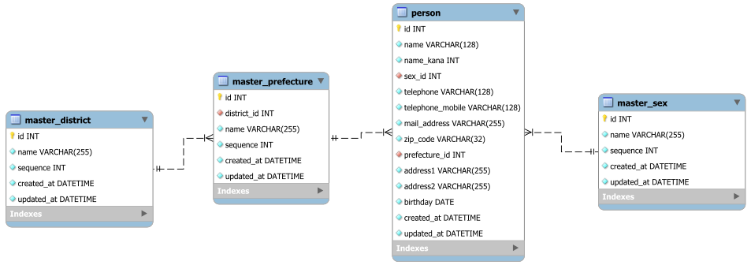

# Django n+1問題サンプル

<!-- TOC -->

- [Django n+1問題サンプル](#django-n1%E5%95%8F%E9%A1%8C%E3%82%B5%E3%83%B3%E3%83%97%E3%83%AB)
- [サンプルの前提条件](#%E3%82%B5%E3%83%B3%E3%83%97%E3%83%AB%E3%81%AE%E5%89%8D%E6%8F%90%E6%9D%A1%E4%BB%B6)
- [サンプルについて](#%E3%82%B5%E3%83%B3%E3%83%97%E3%83%AB%E3%81%AB%E3%81%A4%E3%81%84%E3%81%A6)
    - [1. サンプル概要](#1-%E3%82%B5%E3%83%B3%E3%83%97%E3%83%AB%E6%A6%82%E8%A6%81)
    - [2. DBのテーブル定義](#2-db%E3%81%AE%E3%83%86%E3%83%BC%E3%83%96%E3%83%AB%E5%AE%9A%E7%BE%A9)
    - [3. アプリケーションの設定について](#3-%E3%82%A2%E3%83%97%E3%83%AA%E3%82%B1%E3%83%BC%E3%82%B7%E3%83%A7%E3%83%B3%E3%81%AE%E8%A8%AD%E5%AE%9A%E3%81%AB%E3%81%A4%E3%81%84%E3%81%A6)
    - [4. アプリケーションの実装について](#4-%E3%82%A2%E3%83%97%E3%83%AA%E3%82%B1%E3%83%BC%E3%82%B7%E3%83%A7%E3%83%B3%E3%81%AE%E5%AE%9F%E8%A3%85%E3%81%AB%E3%81%A4%E3%81%84%E3%81%A6)
    - [5. サンプルページについて](#5-%E3%82%B5%E3%83%B3%E3%83%97%E3%83%AB%E3%83%9A%E3%83%BC%E3%82%B8%E3%81%AB%E3%81%A4%E3%81%84%E3%81%A6)
- [Docker環境について](#docker%E7%92%B0%E5%A2%83%E3%81%AB%E3%81%A4%E3%81%84%E3%81%A6)
    - [1. 構成概要](#1-%E6%A7%8B%E6%88%90%E6%A6%82%E8%A6%81)
    - [2. Djangoアプリケーションコンテナ](#2-django%E3%82%A2%E3%83%97%E3%83%AA%E3%82%B1%E3%83%BC%E3%82%B7%E3%83%A7%E3%83%B3%E3%82%B3%E3%83%B3%E3%83%86%E3%83%8A)
    - [3. MariaDBコンテナ](#3-mariadb%E3%82%B3%E3%83%B3%E3%83%86%E3%83%8A)
- [サンプルの動かし方](#%E3%82%B5%E3%83%B3%E3%83%97%E3%83%AB%E3%81%AE%E5%8B%95%E3%81%8B%E3%81%97%E6%96%B9)
    - [1. 準備](#1-%E6%BA%96%E5%82%99)
    - [2. 実行・確認](#2-%E5%AE%9F%E8%A1%8C%E3%83%BB%E7%A2%BA%E8%AA%8D)

<!-- /TOC -->

# サンプルの前提条件

サンプルを動かす際には、LinuxにインストールしたDocker、Docker Compose (v2)が必要です。<br>※私はOracle VM VirtualBoxにUbuntu 22.04のゲストOSを作成し、Dockerをインストールして使用します。<br>Windowsの場合、WSL2でUbuntuをインストールしても使えるはずです。

アプリケーションのコンテナで、アプリケーション実行ユーザーを、ホスト側のグループとユーザーと同じもので作成し、ボリュームを参照するようにしています。


# サンプルについて
## サンプル概要

このサンプルは、DB検索のn+1問題を、Python Djangoで開発したものです。

Djangoアプリケーションは、[Cookiecutter](https://cookiecutter-django.readthedocs.io/en/latest/)で作成し、[app/](app/)に入っています。

このサンプルでは、個人情報を一覧で取得するものです。

## DBのテーブル定義



テーブル一覧

| テーブル名 | 内容 | 参照 |
| :- | :- | :-|
| master_district | 地方マスタ（関東地方、近畿地方、など） |  |
| master_prefecture | 都道府県マスタ | master_district |
| master_sex | 性別マスタ |  |
| person | 個人情報本体 | master_prefecture<br>master_sex |

サンプルでは、個人情報本体に、各種マスタをjoinして検索し、一覧表示するwebページを実装しています。

## アプリケーションの設定について

`app/config/settings`配下に設定ファイルを入れてあり、`local.py`を使用します。

## アプリケーションの実装について

アプリケーションの本体は`app/app`に入っています。

```txt
app
  ├ config
  │  └ settings
  │      └ local.py ・・・ アプリケーションの設定ファイル
  └ app
     ├ master
     │  └ models.py ・・・地方、都道府県、性別のマスタの定義
     ├ person 
     │  ├ models.py ・・・個人情報本体の定義
     │  └ views.py
     │     ├ PersonListView001クラス ・・・ n+1問題の対策前のページのロジック定義（modelsでDB検索）
     │     └ PersonListView002クラス ・・・ n+1問題の対策後のページのロジック定義（modelsでDB検索）
     └ templates
        └ person
           ├ list-001.html ・・・ n+1問題の対策前のページの表示用HTMLテンプレート
           └ list-002.html ・・・ n+1問題の対策後のページの表示用HTMLテンプレート
```

## サンプルページについて

n+1問題の対応前、対応後のDBテーブルからの検索ロジックについて、本サンプルでは、`app/app/person/views.py`の`PersonListView001`、`PersonListView002`クラスに直接書いています。

また、検索フォームは実装しておらず、`PersonListView001`、`PersonListView002`クラスに直接条件も記載し、条件等を直接コード上で修正するようにしています。

本来であれば、検索ロジックは`views.py`に直接書かず、`models.py`にQuerySetを定義するなど、実装し、検索フォームを実装するのですが、本サンプルはn+1問題の対応に特化しているため、省略しています。

# Docker環境について
## 構成概要
本サンプルでは、環境をDockerで定義し、Docker Compose (v2)で起動するよう定義しています。


## Djangoアプリケーションコンテナ

Python、Django環境を構築しています。

サンプルデータをリストアするdumpファイルをボリューム上に起き、コンテナ起動時にMariaDBコンテナのDBにリストアします。

また、サンプルアプリケーションはソースコードをボリュームで参照し、コンテナ起動時に`runserver`(開発サーバ)を起動しています。

## MariaDBコンテナ

すべてのクエリログの出力を有効化し、サーバの文字コードを変更するための設定ファイルをボリュームで定義しています。

DBのファイルについても、ボリュームで定義しています。

クエリ実行時に出力されるクエリログのディレクトリについてもボリュームで定義し、Dockerホスト側から参照できるようにしています。

# サンプルの動かし方
## 準備

GitHubからサンプルを取得し、ディレクトリに移動します。

```bash
git clone https://github.com/murakami0923/django-nplusone-sample.git
cd django-nplusone-sample/
```

Dockerfileをビルドします。

```bash
./docker-build.sh
```

## 実行・確認

Docker Composeで定義したコンテナ起動します。
※必要なボリュームのディレクトリ作成を含みます。

```bash
./start-docker-compose.sh
```

しばらく（実行環境にもよりますが、およそ10秒ほど）待ちます。

しばらく経ったら、ターミナル等でボリュームの中のクエリログをless等で開いておきます。

```bash
sudo less -S volumes/mysql/log/mysql.log
```

※-S : 折り返さずに表示

ブラウザで、n+1問題対応前のページへアクセスします。

```txt
http://{Dockerホストのホスト名orIPアドレス}:8001/person/001/
```

クエリログで、各マスタの取得が個別に行われていることを確認します。

ブラウザで、n+1問題対応後のページへアクセスします。

```txt
http://{Dockerホストのホスト名orIPアドレス}:8001/person/002/
```

クエリログで、マスタも含めてjoinで一括で取得していることを確認します。

確認が終わったら、Docker Composeで定義したコンテナを停止します。

```bash
./stop-docker-compose.sh
```


